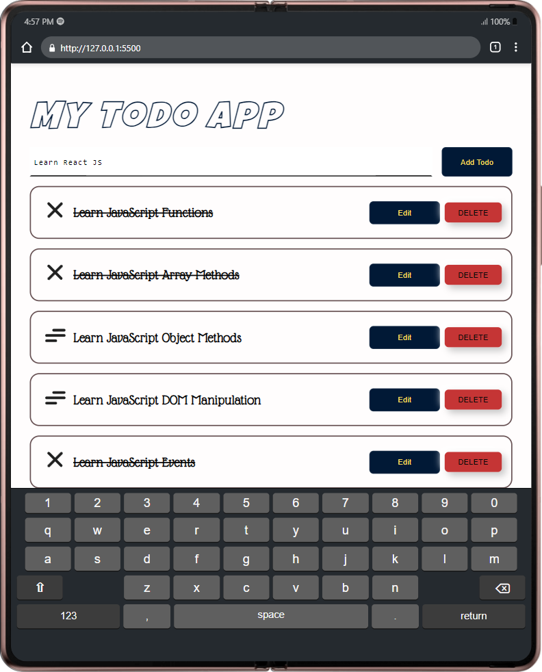
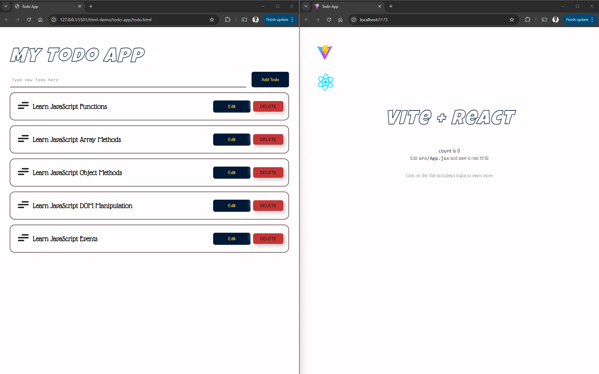

# Todo App

**NOTE: THIS IS THE STARTER CODE. FOR EACH CONCEPT COVERED, VIEW THE RELEVANT BRANCHES.**

## Overview

In this mini-project, we'll cover the basics of React JS by rewriting the below Todo App written in HTML and Vanilla JS in React.

## Topics

1. Component Architecture
2. JSX
3. Prop Basics
4. Destructuring Assignment
5. Lists and Keys
6. React Fragments
7. React Children
8. State
9. Events in React
10. Controlled Inputs
11. `useEffect`
12. React CRUD operations with JSON-server
13. React x Tailwind CSS

## System Requirements

- Node 18+
- JSON Server
- Live Server extension (VS Code).
- ES7 React/Redux/GraphQL/React-Native snippets. ([click here to install](https://marketplace.visualstudio.com/items?itemName=rodrigovallades.es7-react-js-snippets))
- A browser capable of running JavaScript (Chrome, Firefox, Safari, or Edge)
- Operating System (Windows 10+, MacOS, Linux, etc.)
- A text editor capable of running JavaScript (Visual Studio Code, Vim, Nano, Emacs, Atom, Sublime Text, etc.)
- RAM >= 4GB
- Disk space >= 1GB

## Installation

To use this repo, follow these steps:

### Alternative One

1.  Open the terminal/CLI on your computer.

2.  Clone the repository by running the following command:

        git clone https://github.com/oyieroyier/todo-app.git

3.  Change directory to the repo folder:

        cd todo-app

4.  Open it in your Code Editor of choice. If you use VS Code, run the command:

        code .

### Alternative Two

- On the top right corner of this page there is a button labelled `Fork`.

- Click on that button to create a copy of the repository to your own account.

- Follow the process described in `Alternative One` above.

- Remember to replace your username when cloning.

      git clone https://github.com/your-github-username-here/todo-app.git

## Running the application locally

### Previewing the HTML/Vanilla JS version of the application.

- In the file tree, click on the `html-demo` folder

- Right click on the `todo.html` file to show the context menu and select `Open with Live Server` option.

- This will open the file in your browser.

- If using VS Code and don't have Live Server installed [CLICK HERE](https://marketplace.visualstudio.com/items?itemName=ritwickdey.LiveServer) to install it and repeat the second step.

### Running the React Version

- Open the integrated terminal in your code editor and install the project dependencies:

      npm install

- Once done with the installation, run the development server in your terminal.

      npm run dev

- You should see the notification `Your application running on port 5173 is available.` at the bottom of your editor.
- If using VS Code, click the `Open in Browser` button.
- If using any other editor, copy the link in the terminal and open it on your browser.

      http://localhost:5173/

When both versions of the application are running, you should see something similar on the browser windows where they are open.

## Authors

[Bob Oyier](https://github.com/oyieroyier/)
